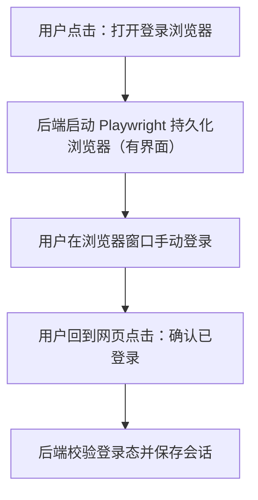
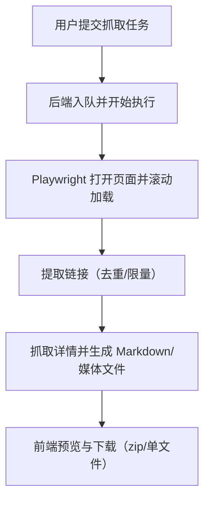

## 1. 产品概述
一个可自部署的网页工具，用来通过正常网页访问方式抓取小红书内容：你在网页里发起“登录/抓取”任务，服务端使用 Playwright 打开网页并抓取搜索/用户/笔记内容，最终导出 Markdown（可选下载图片）。
- 目标用户：需要把小红书内容整理成可阅读/可归档文档的个人与团队
- 价值：把“手动复制粘贴”变成可复用流程，统一导出格式，支持批量化与结果归档

## 2. 核心功能

### 2.1 用户角色
| 角色 | 进入方式 | 核心权限 |
|------|----------|----------|
| 管理员（单用户） | 本地/自部署访问 | 发起登录、发起抓取任务、下载结果、查看历史任务 |

### 2.2 功能模块
1. **控制台**：任务创建（关键词/用户/笔记链接）、参数配置、任务队列与状态
2. **登录管理**：一键拉起“可视化浏览器”用于手动登录，保存并复用会话
3. **结果中心**：任务结果预览（Markdown）、附件（图片）下载、索引页导出

### 2.3 页面详情
| 页面名称 | 模块名称 | 功能描述 |
|---------|----------|----------|
| / | 顶部状态条 | 显示登录状态（已登录/未登录）、当前运行环境提示（需要桌面/远程桌面才能看到登录浏览器窗口） |
| / | 新建任务 | 选择任务类型（关键词搜索/用户主页/笔记链接），填写参数（关键词、链接、条数限制、是否下载图片、输出命名），提交后进入队列 |
| / | 任务列表 | 展示最近任务：状态（排队/运行中/成功/失败）、开始/结束时间、日志摘要、下载入口 |
| /tasks/:id | 任务详情 | 展示进度、详细日志、导出的 index.md 预览、单条笔记列表与下载 |

## 3. 核心流程

### 3.1 登录流程（手动一次）
用户在网页点击“打开登录浏览器” → 服务端在运行主机上启动一个带界面的 Chromium（Playwright 持久化用户目录） → 用户在弹出的浏览器中完成登录 → 回到网页点击“确认已登录”进行校验 → 保存会话供后续任务复用。

### 3.2 抓取流程（关键词/用户/笔记）
用户在网页创建任务 → 后端进入队列执行（节流、重试、去重） → 生成 `out/<task_id>/index.md` 与 `notes/*.md`（可选 `media/`） → 前端展示预览并提供下载。

## 4. 用户界面设计

### 4.1 设计风格
- 整体：编辑部/资料库风格（高信息密度但克制，强调可读性与可归档）
- 主色：深灰与米白为底色，强调色使用“朱红”用于状态与关键按钮
- 字体：标题使用更有性格的衬线/展示字体，正文使用易读的无衬线
- 布局：顶部导航 + 左侧任务列表 + 右侧详情面板（桌面优先）
- 动效：任务状态变化使用轻量过渡与骨架屏；导出完成有明确的完成提示

### 4.2 页面设计概览
| 页面名称 | 模块名称 | UI 元素 |
|---------|----------|---------|
| / | 新建任务 | 分段表单（任务类型 Tabs + 参数区 + 提交区），提交按钮突出；表单支持“保存为默认配置” |
| / | 任务列表 | 表格/卡片混合：左侧列表可滚动；状态徽标（排队/运行中/成功/失败），点击进入详情 |
| /tasks/:id | 预览与下载 | Markdown 预览区（代码块/引用样式），附件列表（图片缩略图），下载按钮（单文件/打包） |

### 4.3 响应式
- 桌面优先；移动端缩减为单列：先列表后详情，预览区可折叠

