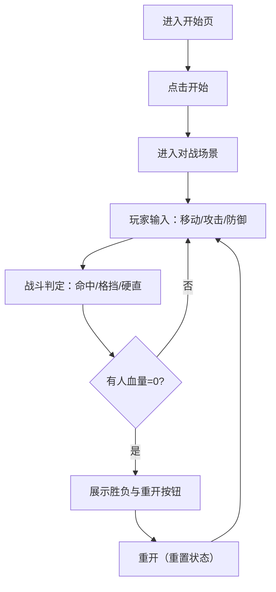

## 1. 产品概述
一个浏览器端像素风双人机甲对战小游戏：两台机甲在同一屏幕内对战，支持移动、攻击、防御与受击硬直，先将对方血量打空者获胜。
- 目标用户：喜欢街机格斗/像素风的轻度玩家；适合朋友同屏对战与键盘操作练手
- 价值：规则简单、即开即玩、反馈清晰（打击/防御/硬直/血条/胜负提示）

## 2. 核心功能

### 2.1 用户角色
| 角色 | 使用方式 | 核心权限 |
|------|----------|----------|
| 玩家1 | 本地键盘 | 操作机甲A进行移动/攻击/防御 |
| 玩家2 | 本地键盘 | 操作机甲B进行移动/攻击/防御 |

### 2.2 功能模块
1. **开始/对战页**：开始按钮、操作提示、进入对战
2. **对战 HUD**：双方血条、能量/防御提示（简化为防御状态指示）、回合信息（倒计时可选）
3. **场景与角色渲染**：像素风背景、地面、角色精灵动画、受击/攻击特效
4. **战斗系统**：碰撞判定、伤害计算、无敌/硬直窗口、胜负判定、重开

### 2.3 页面详情
| 页面名称 | 模块名称 | 功能描述 |
|----------|----------|----------|
| / | 开始界面 | 显示游戏标题、像素风装饰、开始按钮、按键说明 |
| /game | 对战场景 | 渲染场景与机甲、处理输入与战斗逻辑、显示 HUD、胜负弹层与重开 |

## 3. 核心流程
玩家在开始页查看按键说明并开始 → 进入对战 → 双方移动接近 → 攻击/防御交互（命中扣血、防御减伤） → 任意一方血量归零触发胜负 → 可重开回到对战。

## 4. 玩法与规则（可运行 Demo 版本）

### 4.1 目标
- 将对方血量（HP）降为 0 获胜

### 4.2 操作（同屏双人）
- 玩家1（左侧机甲A）：A/D 移动，W 防御，F 攻击
- 玩家2（右侧机甲B）：←/→ 移动，↑ 防御，/ 攻击（Slash 键）
- 规则简化：仅水平移动；跳跃与连招后续可扩展

### 4.3 状态与数值
- 初始 HP：100
- 攻击伤害：10
- 防御减伤：60%（受击但不硬直，或硬直时间更短）
- 攻击冷却：0.35s
- 受击硬直：0.18s（硬直期间无法攻击/防御，仍可被击中但可配置无敌帧）
- 攻击距离：以“攻击盒（hitbox）”与对方“受击盒（hurtbox）”相交为命中

### 4.4 胜负与重开
- 任意一方 HP ≤ 0：游戏进入结束态
- HUD 显示胜负结果（P1 WIN / P2 WIN）并提供“再来一局”

## 5. 用户界面设计（像素/复古风）

### 5.1 设计风格
- 主色：深夜蓝/墨黑背景（#0b1020/#060812），荧光青与机甲红作为对比色
- UI：像素边框、硬朗矩形按钮、轻微抖动/扫描线效果（可选）
- 字体：使用像素风字体（网页字体文件或 CSS 像素替代）
- 反馈：攻击闪光、受击抖动、血条“掉血”动画

### 5.2 页面设计概览
| 页面名称 | 模块名称 | UI 元素 |
|----------|----------|----------|
| / | 标题区 | 像素标题、霓虹描边、背景网格或星空点阵 |
| / | 按键说明 | 两列对照（P1/P2），像素图标与文本 |
| / | 开始按钮 | 像素边框按钮，hover 有亮度/位移反馈 |
| /game | HUD | 顶部左右血条、姓名/机体代号、状态指示（DEF/COOLDOWN） |
| /game | 战斗区 | 地面、远景建筑剪影、像素粒子与命中特效 |
| /game | 结束弹层 | 半透明遮罩 + 像素边框弹窗 + 再来一局按钮 |

### 5.3 自适应
- 桌面优先：键盘操作为主
- 兼容小屏：画布等比缩放，HUD 采用百分比布局避免遮挡

## 6. 基础素材方案（Demo 可落地）

### 6.1 角色素材（机甲 A/B）
- 采用“程序生成像素块 + 简易帧动画”的方式：用 Canvas 绘制像素块组成机体（头/躯干/臂/腿），并通过少量姿态切换实现动画
- 动画帧（每个机甲至少 4 组）：
  - idle：2 帧轻微呼吸/灯光闪烁
  - walk：4 帧腿部交替
  - attack：3 帧出拳/能量刃
  - block：2 帧抬臂护盾
  - hit：1-2 帧受击后仰

### 6.2 场景素材
- 背景：远景城市剪影（深色），近景地面像素格栅
- 特效：命中火花（像素十字/星形 3 帧），受击抖动（屏幕或角色局部）

### 6.3 声效（可选）
- 用 WebAudio 生成简易方波/噪声：攻击“啪”、格挡“当”、受击“咚”、胜利提示音
