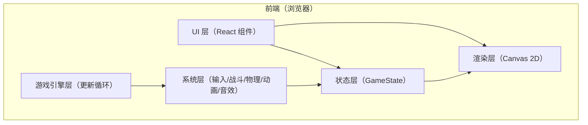

## 1. 架构设计

## 2. 技术说明
- 前端：React@18 + TypeScript + Vite
- 渲染：Canvas 2D（像素风：nearest-neighbor 缩放、整数像素对齐、低分辨率内部画布）
- 状态管理：轻量本地状态（useReducer/useRef）+ 纯函数更新
- 音效（可选）：WebAudio（方波/噪声生成），不引入外部音频文件亦可跑通
- 后端：无
- 数据：本地常量与运行时状态（不持久化）

## 3. 路由定义
| 路由 | 用途 |
|------|------|
| / | 开始页：标题、操作提示、开始按钮 |
| /game | 对战页：Canvas 场景 + HUD + 结束弹层 |

## 4. 核心模块划分（建议目录）
- src/app：路由与页面（StartPage/GamePage）
- src/game：
  - engine：主循环（requestAnimationFrame）、时间步长、暂停/结束状态
  - input：键盘映射、按键状态（pressed/justPressed）
  - physics：简化移动与边界限制、AABB 盒体
  - combat：攻击盒/受击盒计算、命中判定、冷却与硬直、减伤逻辑
  - animation：基于状态的帧选择（idle/walk/attack/block/hit）
  - render：像素风绘制（地面/背景/机甲/特效/HUD overlay）
  - audio：可选音效生成与播放
  - types：Player、GameState、Rect、Vec2、Frame 等类型

## 5. 状态与数据模型

### 5.1 状态结构（TypeScript 类型草案）
- GameState
  - phase：'menu' | 'playing' | 'ended'
  - arena：宽高、地面高度、左右边界
  - players：P1/P2 的 PlayerState
  - effects：命中特效列表（带生命周期）
  - winner：'p1' | 'p2' | null
- PlayerState
  - id：'p1' | 'p2'
  - hp：number
  - pos：Vec2
  - facing：'left' | 'right'
  - velocity：Vec2（仅用 x 也可）
  - isBlocking：boolean
  - cooldown：攻击冷却剩余
  - hitstun：硬直剩余
  - anim：当前动画状态与帧计时

### 5.2 判定与时间步
- 采用固定上限的 deltaTime：dt = min(realDt, 0.033) 防止切回页面导致瞬移
- 更新顺序（每帧）：
  1) 读取输入（justPressed/pressed）
  2) 更新玩家意图（移动/防御/攻击触发）
  3) 推进冷却/硬直计时
  4) 生成攻击盒 → 与对方受击盒相交判定 → 结算伤害/硬直/特效/音效
  5) 更新位置（边界夹紧）、朝向（根据 상대 位置）
  6) 更新动画帧
  7) 检查胜负（hp<=0）

## 6. 可运行 Demo 的工程化约束
- 不依赖外部图片：角色与背景用程序绘制像素块，确保开箱即跑
- 内部渲染分辨率固定（例如 320×180），再整数倍放大到显示区域
- 输入支持同屏双人键位，默认不做可配置 UI（后续扩展点）
