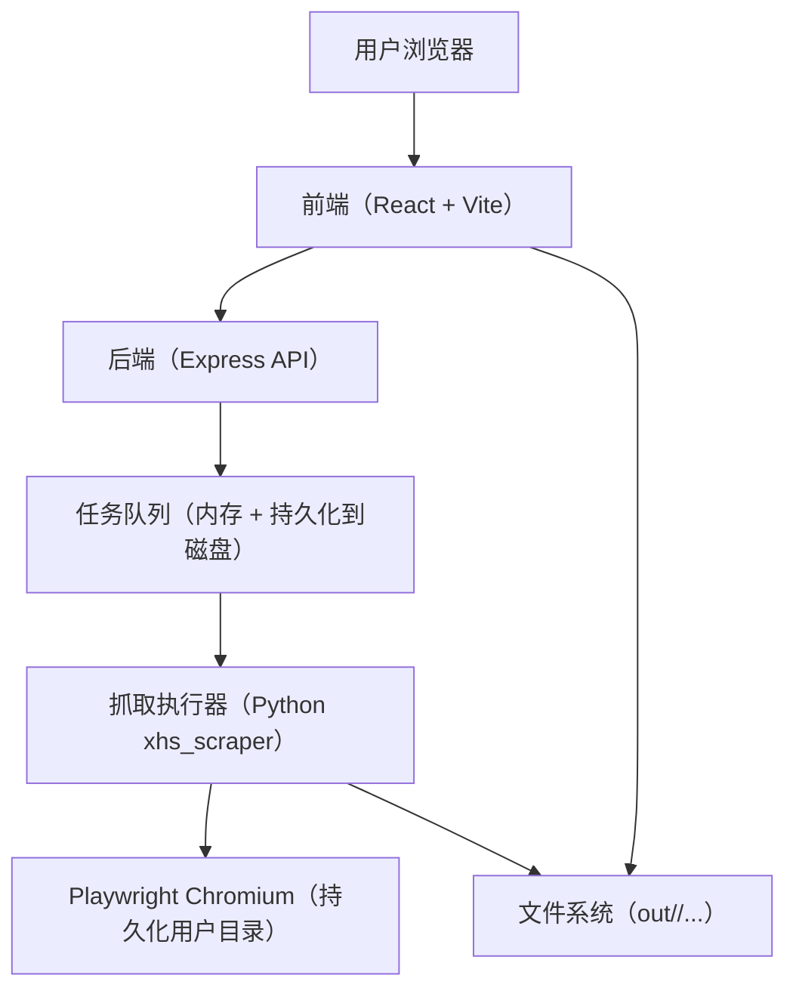
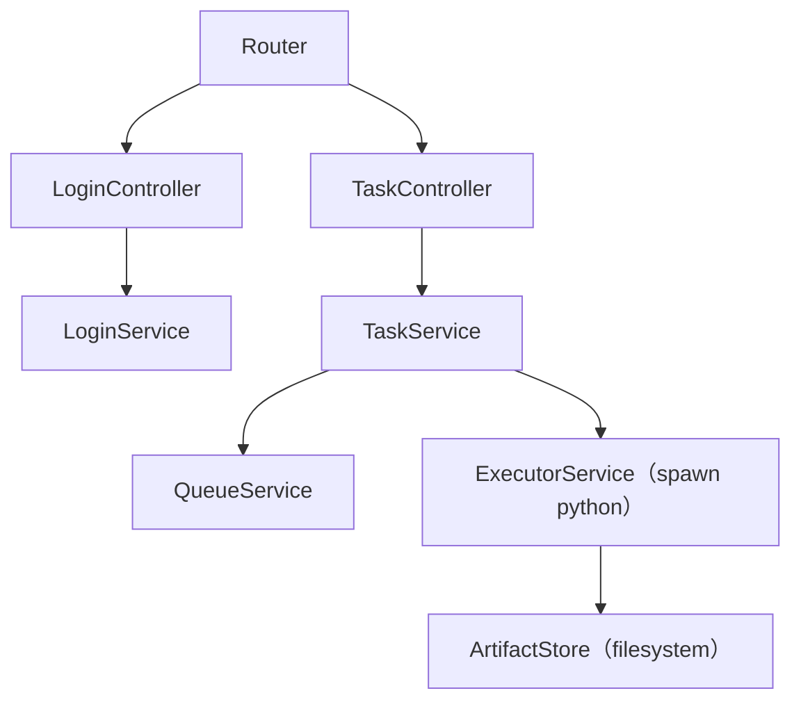
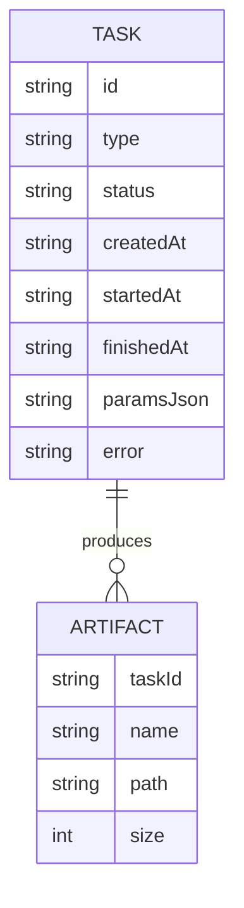

## 1. 架构设计



说明：
- 前端负责任务创建、状态展示、Markdown 预览、下载入口
- 后端负责任务队列、日志聚合、结果目录管理，并调用现有 Python 抓取逻辑执行
- 抓取执行器遵循“正常自动化 + 手动登录一次”，不实现风控规避

## 2. 技术选型说明
- 前端：React@18 + TypeScript + tailwindcss + react-router-dom + zustand
- 初始化工具：vite-init
- 后端：Express@4（TypeScript，ESM）
- 抓取：复用现有 Python 模块 `xhs_scraper`（Playwright）
- 存储：不引入数据库，任务与结果落盘（JSON + Markdown + 媒体文件）
- 打包部署：Docker（可选），默认自托管单机运行

## 3. 路由定义
| Route | Purpose |
|-------|---------|
| / | 控制台：新建任务 + 任务列表 + 快速预览 |
| /tasks/:id | 任务详情：日志、预览、下载 |

## 4. API 定义

### 4.1 类型定义（共享）

```ts
export type TaskType = "search" | "user" | "note"

export type TaskStatus = "queued" | "running" | "succeeded" | "failed" | "canceled"

export interface CreateTaskRequest {
  type: TaskType
  keyword?: string
  url?: string
  limit?: number
  downloadMedia?: boolean
  headedLogin?: boolean
}

export interface TaskSummary {
  id: string
  type: TaskType
  status: TaskStatus
  createdAt: string
  startedAt?: string
  finishedAt?: string
  error?: string
}

export interface TaskDetail extends TaskSummary {
  logs: string[]
  outputDir?: string
  indexMdPath?: string
  artifacts?: Array<{ name: string; path: string; size: number }>
}
```

### 4.2 接口列表
| Method | Path | Purpose |
|--------|------|---------|
| POST | /api/login/open | 在运行主机上启动带界面的浏览器用于手动登录（复用用户目录） |
| GET | /api/login/status | 校验当前会话是否已登录（通过访问站点并检查关键元素/接口返回） |
| POST | /api/tasks | 创建抓取任务（入队） |
| GET | /api/tasks | 列出任务（分页/最近 N 条） |
| GET | /api/tasks/:id | 获取任务详情（含日志与产物列表） |
| POST | /api/tasks/:id/cancel | 取消任务（若支持） |
| GET | /api/tasks/:id/index.md | 获取该任务导出的 index.md（用于预览） |
| GET | /api/tasks/:id/download | 下载该任务产物（zip） |

### 4.3 关键行为约束
- 所有抓取任务必须带节流参数（默认 0.8s）与最大滚动轮次，避免无限滚动
- 登录启动仅在“有界面环境”可用：远程服务器需远程桌面/带 GUI 的运行环境

## 5. 服务端架构图



## 6. 数据模型

### 6.1 数据模型定义（落盘 JSON）



### 6.2 数据定义（文件结构）
- `data/tasks/<task_id>.json`：任务元信息与状态
- `data/logs/<task_id>.log`：任务日志（追加写）
- `data/out/<task_id>/index.md`：导出索引
- `data/out/<task_id>/notes/*.md`：每条笔记 Markdown
- `data/out/<task_id>/media/<note_id>/*`：可选媒体文件

