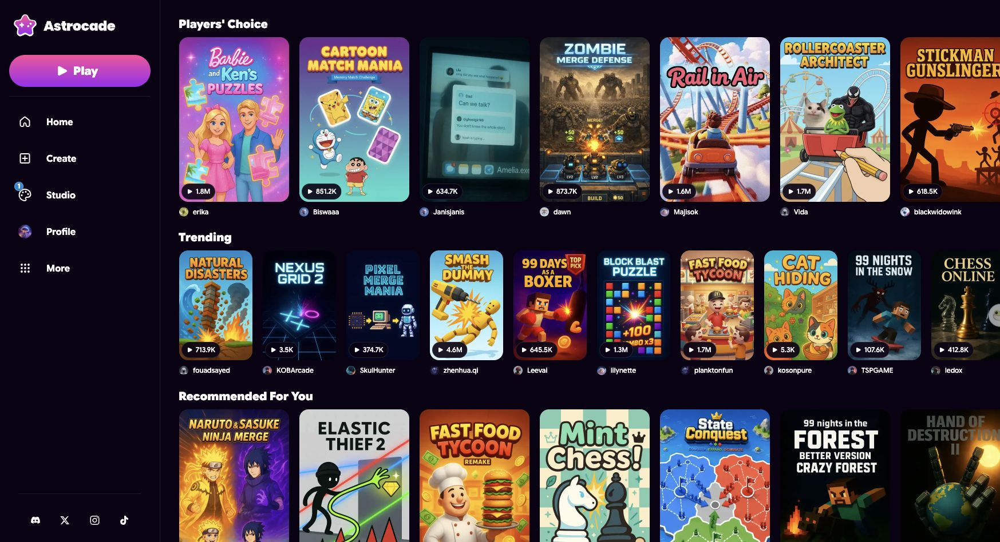
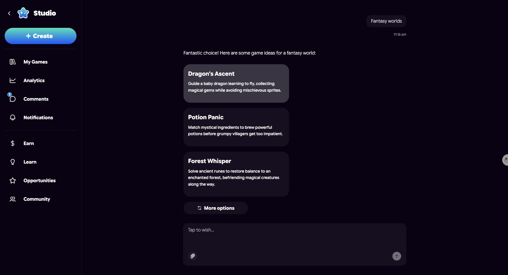
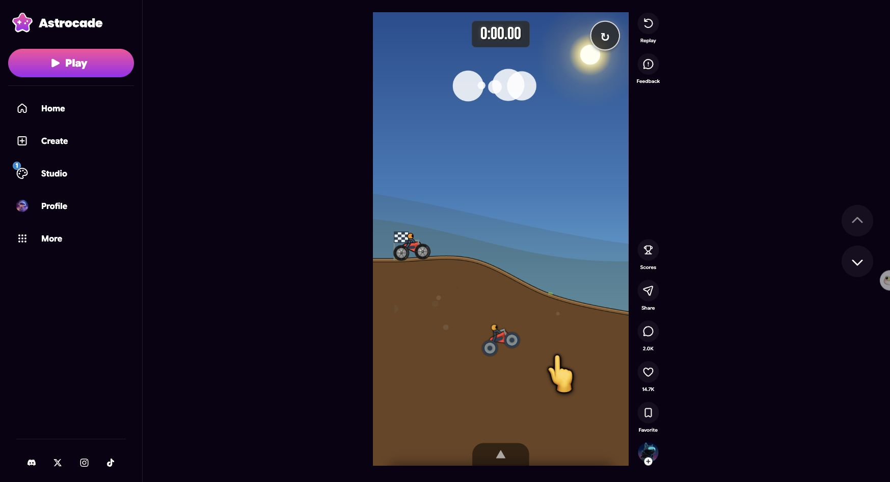
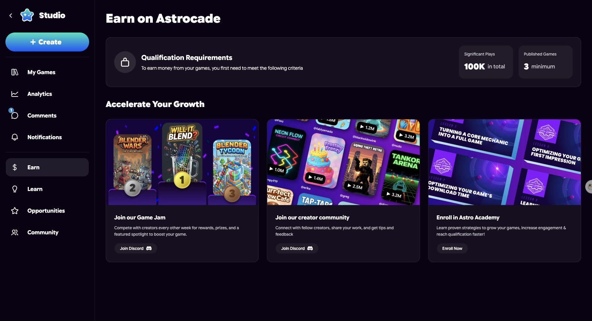
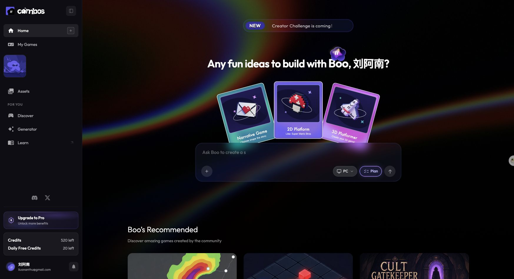
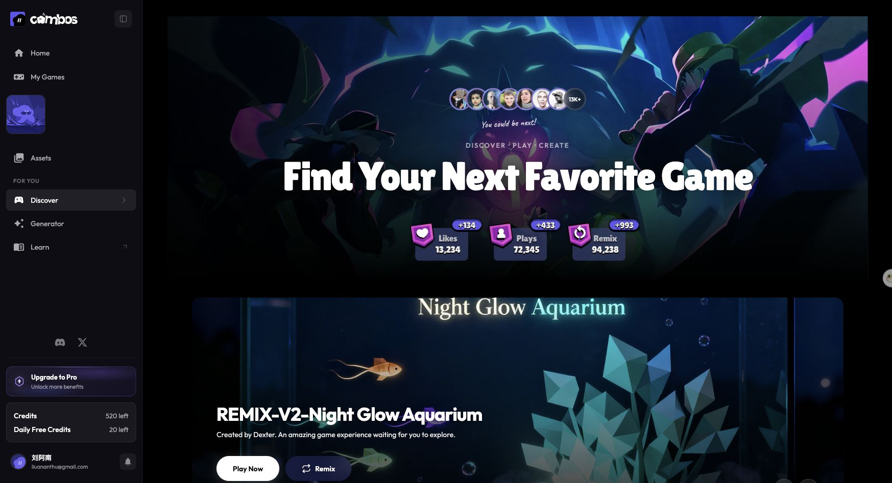
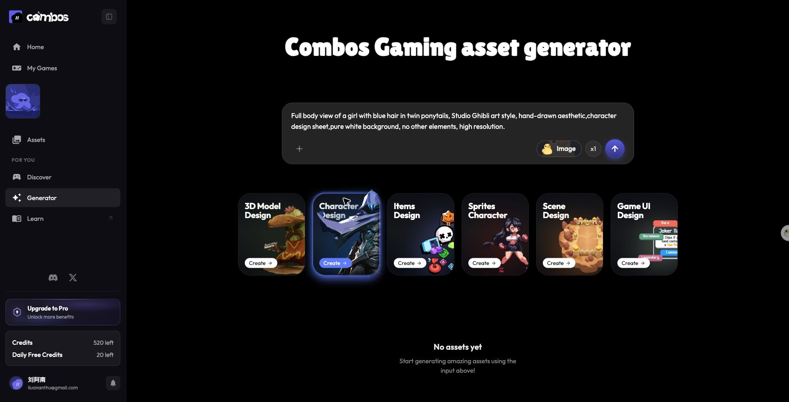

# AI游戏产品调研

日期：2026-05-27  
主题：AI 游戏、AI playable、UGC 游戏平台、创作者互动内容、消费级游戏内容 feed

## 1. 核心结论

这类产品的核心机会不是“AI 做游戏”，而是“把游戏变成一种可快速生成、分享、消费、二创的内容格式”。

市场空间成立，但仍处在早期验证期。AI 已经明显降低了供给端门槛：用户可以用自然语言、模板、图片、视频、素材生成器来做小游戏或互动内容。真正还没有被充分证明的是另一侧：分发、留存、内容质量、推荐治理、创作者经济和未成年人安全。

更准确地说，AI 游戏产品不是一个单一路线，而是几类路线的交叉：

- UGC 游戏平台：Roblox、Fortnite / UEFN。
- AI playable feed：Astrocade、Loopit、Aippy。
- AI 游戏创作工作台：Combos、Makko、Rosebud、Exists、Nitrode。
- 大平台互动内容格式：YouTube Playables Builder。
- AI 原生玩法：Gradient Bang、AI Dungeon、Hidden Door。
- Video-native playable：Yoroll。
- B2B playable / 游戏营销：playable ads、互动 campaign、游戏素材自动生成。

目前最稳的判断是：先做“可分享的 AI playable 内容工具”，再做“社区/feed”，最后才挑战“完整 AI 游戏平台”。因为游戏消费的难点不是能不能生成，而是好不好玩、能不能反复玩、朋友是否愿意一起玩、创作者能否赚钱。

## 2. 市场空间与信号

### 2.1 大盘足够大

全球游戏市场本身足够大。Newzoo 2025 全球游戏市场报告预计，2025 年全球游戏收入约 1888 亿美元，玩家约 36 亿；移动端仍是最大盘子。Newzoo 同时把 Roblox、UGC、平台生态列为影响玩家参与和 IP 构建的重要趋势。

这说明 AI 游戏产品不需要重新证明“游戏是大市场”，它要证明的是：AI 能不能把游戏从“高成本作品”变成“高频互动内容格式”。

### 2.2 最强参考不是 AI 产品，而是 UGC 游戏平台

Roblox 和 Fortnite / UEFN 已经证明，UGC 游戏内容可以形成十亿美元级平台经济。

- Roblox：2025 年收入 49 亿美元，bookings 68 亿美元，平均 DAU 1.27 亿，参与时长 1240 亿小时，创作者收入超过 15 亿美元；2026 Q1 仍有 1.32 亿 DAU 和 310 亿小时参与时长。
- Fortnite / UEFN：2024 年向创作者支付 3.52 亿美元，玩家在创作者游戏中花费 52.3 亿小时，占 Fortnite 总游戏时长 36.5%。
- YouTube Playables Builder：YouTube 已测试用 Gemini 3 让创作者通过文本、图片、视频 prompt 生成小游戏并分享给观众。这是“游戏变成创作者内容格式”的大平台信号。

AI 原生产品现在还没有出现 Roblox 级别的大平台，但 UGC 游戏和互动内容的需求已经被大平台证明。

### 2.3 AI 的真实机会在供给端和内容形态端

AI 对游戏行业的直接价值不是“把所有人都变成专业游戏开发者”，而是让更多人可以生产更小、更轻、更快的互动内容：

- 互动 meme。
- 小游戏。
- 触觉玩具 / fidget toy。
- ASMR playable。
- 互动短剧。
- 粉丝挑战。
- 教育测验。
- 品牌 campaign playable。
- 游戏营销素材。
- 动态 NPC / AI GM / AI 世界事件。

这类内容未必都符合传统“游戏”的定义，但它们符合消费内容平台的逻辑：短、快、可分享、可 remix、可连续消费。

## 3. 产品版图

| 类型 | 代表产品 | 核心价值 | 当前判断 |
|---|---|---|---|
| 成熟 UGC 游戏平台 | Roblox | 创作工具、社交、虚拟经济、推荐、安全治理 | 已经证明大市场和创作者经济 |
| 高质量 UGC 游戏引擎平台 | Fortnite / UEFN | Unreal 级工具、Fortnite 流量、Creator Portal、收益分成 | 工具上限高，但 Discover 和治理压力大 |
| 大平台互动内容格式 | YouTube Playables Builder | 视频创作者用 AI 生成轻量小游戏，分发给既有观众 | 分发优势强，游戏深度待验证 |
| AI playable feed | Astrocade、Loopit、Aippy | prompt -> playable -> feed -> remix | 最接近“AI 游戏消费产品”的当前形态 |
| AI 游戏创作工作台 | Combos、Makko、Rosebud、Exists、Nitrode | AI agent、模板、素材生成、发布和 remix | 更容易先商业化，但可能停留在工具 |
| AI 原生玩法 | Gradient Bang、AI Dungeon、Hidden Door | LLM/agent/world model 成为玩法本身 | 潜力大，但稳定性、成本和留存压力高 |
| Video-native playable | Yoroll | 生成视频 + 分支逻辑 + 状态管理 + playable runtime | 更像未来技术路线，普通用户验证还早 |

## 4. Astrocade 与 Combos 实测总结

本节基于 Chrome 实测和截图记录。截图保存在 `chrome-screenshots/` 目录。

### 4.1 Astrocade

Astrocade 更像“AI 生成游戏 + TikTok/Roblox 式分发 + 创作者经济”的消费平台。

核心产品特征：

- 消费侧：首页是游戏消费/发现页，以 Players' Choice、Trending 等 feed 展示社区游戏，卡片显示播放量和作者。
- 创作侧：创建入口是聊天式 wish-to-game 流程，用户可以用自然语言、灵感按钮、题材选择和创意卡片降低从空白开始的门槛。
- 社区侧：游戏详情页支持试玩、分数、分享、评论、点赞、收藏、关注创作者。
- 变现侧：Earn 页面显示创作者变现门槛，总播放量 100K、至少发布 3 个游戏，并引导加入 Game Jam、Creator Community、Astro Academy。

Astrocade 的第一性不是编辑器，而是消费平台。它要解决的是“用户为什么一直玩、一直刷、一直 remix”，而不是单纯“AI 能不能生成游戏”。

### 4.2 Combos

Combos 更像“AI game agent + 游戏模板/素材生成 + 社区 Remix”的创作工作台。

核心产品特征：

- 创建侧：中心是 Boo prompt、模板、Plan、Create game、平台选择和 credits。
- 模板侧：有 Narrative Game、2D Platform、3D Platformer 等起步模板，适合从类型模板快速启动。
- 社区侧：Discover、Play、Remix、Like、Comment、Plays 已经接上，说明它不只是编辑器，也在补内容消费闭环。
- 资产侧：Generator 覆盖 Image、3D Model、Character、Items、Sprites、Scene、Game UI 等游戏资产。
- 商业化侧：侧边栏有 credits 和 Upgrade to Pro，当前更像订阅/credits 驱动的创作工具。

Combos 的第一性是创作工具。它更适合先服务 indie、学生、老师、内容创作者和小团队，再通过 Discover/Remix 逐步积累社区内容。

### 4.3 Astrocade vs Combos

| 维度 | Astrocade | Combos |
|---|---|---|
| 第一性 | 消费平台 | 创作工作台 |
| 核心闭环 | 玩、刷、关注、互动、创作、变现 | prompt、模板、素材、生成、发布、remix |
| 更像谁 | Loopit + Roblox + TikTok for games | UEFN / Roblox Studio 的轻量 AI 版本 |
| 当前商业化想象 | 创作者经济、Game Jam、播放量激励、平台内分发 | 订阅、credits、素材生成、创作者工具 |
| 最大挑战 | 内容质量、推荐、留存、治理、创作者收益 | 生成质量、编辑可控性、工作流深度、社区冷启动 |

两者都没有把“AI 生成”单独作为终点，而是在做一个闭环：

prompt -> 生成 -> 试玩 -> 发布 -> 发现 -> 互动 / remix -> 再创作。

## 5. 重点参考案例

### 5.1 Roblox

Roblox 的壁垒不是“做游戏编辑器”，而是完整飞轮：

创作者供给 -> 内容发现 -> 社交关系 -> 虚拟经济 -> 创作者赚钱 -> 更多内容供给。

产品功能：

- 玩家侧：以体验/游戏为基本内容单位，用户在游戏内聊天、组队、互动、购买虚拟物品。
- 创作者侧：Roblox Studio 提供脚本、3D 场景、物理、角色、道具、经济系统、数据分析和发布能力。
- AI 侧：Roblox 正在加入 Assistant、4D 对象生成、Text-to-Speech、Speech-to-Text、动态 NPC、实时语音翻译、MCP 接入 Studio Assistant。
- 发现侧：除首页推荐、搜索、分类、广告外，Roblox Moments 把短视频片段变成进入体验的新入口。
- 商业化：DevEx、Robux、广告、Rewarded Video Ads、区域定价、IP 授权目录。

用户反馈与风险：

- 正向：内容量极大，朋友关系和共同游玩构成强留存；小团队也能做出大 DAU 产品。
- 负向：未成年人安全、聊天、外链、成人与儿童互动、违规内容、Robux 和微交易压力长期被批评。
- 新问题：age-check 能改善安全，但也增加验证摩擦，影响通信和新增用户获取。

对 AI 游戏产品的启发：

只做“生成游戏”不够。长期价值来自社交、推荐、经济、安全和内容供给的系统。

### 5.2 Fortnite / UEFN

UEFN 代表“专业游戏引擎能力进入超级游戏平台”。

产品功能：

- UEFN 是 Unreal Engine 驱动的 Fortnite 创作工具。
- 支持视口、Outliner、Details panel、Content Browser、World Settings、World Partition、Unreal Revision Control、Verse Explorer、Ask AI 等编辑器模块。
- 支持导入 FBX、OBJ、glTF、GLB、图片、音频、CSV、JSON 等资产。
- 支持 Verse 脚本、设备系统、NPC、持久化、自定义 UI、第一人称相机、HUD、Input Trigger、Proximity Chat 等能力。
- Creator Portal 提供发布、数据、收益、玩家群体、payout metrics、island satisfaction 等管理能力。

用户反馈与风险：

- 正向：专业团队可以用更高质量的工具，在 Fortnite 流量池里发布互动内容。
- 负向：Discover 是最大痛点，原创高投入地图未必获得展示，低投入、重复、点击诱导、XP farm 内容容易占据推荐。
- 商业化风险：in-island transactions 带来随机付费、疑似 loot box、退款困难等争议。
- 门槛：UEFN 能力强，但学习曲线高，仍需要游戏设计、资产、技术和运营能力。

对 AI 游戏产品的启发：

高质量工具提升内容上限，但不会自动提升平均内容质量。开放创作者变现后，推荐算法、交易安全、退款、审核和未成年人保护会立刻成为核心问题。

### 5.3 YouTube Playables Builder

YouTube Playables Builder 的关键意义是：大内容平台正在把 playable 变成创作者内容格式。

产品功能：

- YouTube Playables 基础层已支持桌面、iOS、Android 上的轻量小游戏，并有分享、保存进度、历史最高分。
- Playables Builder 进入 beta 后，创作者可以用文本、图片、视频 prompt 生成轻量 playable。
- 当前仍是 Trusted Tester / selected markets 试点。

用户与行业反馈：

- 正向：YouTube 有全球创作者、粉丝关系和推荐系统，分发能力强。
- 正向：视频创作者可以把频道人设、粉丝梗、视频素材变成互动内容。
- 负向：行业反馈谨慎，当前示例多是简单 platformer 或基础 dashboard，质量和原创性难以和成熟游戏相比。
- 风险：平台如果奖励低努力 AI 内容，会引发 AI slop 和 creator-made / AI-made 争议。

对 AI 游戏产品的启发：

AI playable 不一定要先成为独立游戏社区，也可以成为现有内容平台的新格式：YouTube 频道互动、TikTok / Shorts 后链路互动页、Discord 社区小游戏、直播间挑战、品牌 campaign。

### 5.4 Loopit

Loopit 是最接近 Astrocade 的 AI-native 消费端参考之一。

产品功能：

- 文本描述生成 playable。
- AI 生成逻辑和美术。
- No-code 编辑。
- Feed 流消费。
- Remix：看到有趣内容后，修改机制、替换视觉、重新发布。
- 内容类型包括互动 meme、ASMR / tactile toys、playable art、mini puzzles、simulations。
- 36Kr 报道称 Loopit 支持文本、图片、语音、视频、3D 等多模态互动内容，底层是 Coding Agent + 多模态 Agent。

规模与反馈：

- 报道称 Loopit 2026 年 2 月上线，两个月内全球注册用户近 200 万，超过一半来自北美；次日留存从早期 30% 提升到 50%+，用户创作率达到 30%。
- AppBrain 数据显示 Android 端 320 万下载、近 30 天 97 万下载、4.74/5 分、约 1.5 万 ratings、娱乐榜 #1。
- 正向反馈集中在“上瘾”“像 TikTok 但没有视频，是可互动小游戏/解压内容”“没有广告”“适合 fidget/打发时间”。
- 负向反馈集中在 feed 困惑、内容重复、权限安全、未成年人可能接触不适内容。

对 AI 游戏产品的启发：

Loopit 的突破点不是“生成大作”，而是把互动内容拆得更小。相比“我要生成一款完整游戏”，playable card、互动 meme、触觉玩具、小谜题、模拟器更适合移动端 feed，也更适合当前 AI 生成能力边界。

### 5.5 Aippy

Aippy 是 Loopit 之外值得跟踪的移动端 AI playable 近邻。

产品功能：

- iOS 端标题为 Aippy: Game Maker，Android / AppBrain 页面使用 Aippy: AI Game Maker。
- 开发者为 NADA AI PTE. LTD.。
- 用户可用自然语言生成 playable mini game、interactive story、utility tool、generator、interactive art。
- Feed / gallery 消费：用户可以刷别人做的小游戏、工具、互动艺术。
- Remix：看到已有作品后复制为起点，修改机制、视觉或玩法后再发布。
- 近期版本更新出现 meme GIF/audio support、browse history、saved projects、community levels、user blocking、login security 等能力，说明它正在从生成器走向社区、账户和内容治理。

规模与反馈：

- AppBrain 抓取数据显示 Android 端 100 万+下载，4.75/5 分，约 6100 条 reviews。
- App Store 页面显示 4.8/5 分，3.7K ratings。
- 正向反馈集中在容易上手、生成速度快、能直接玩别人作品。
- 有用户提到自己做的 tap game 获得 1k+ views，说明它已经出现轻量创作者反馈循环。
- 风险包括 13+ 年龄分级、User-Generated Content、Simulated Gambling、Contests、Mature/Suggestive Themes、隐私和数据处理、未来虚拟币/内购/创作者分成的治理复杂度。

对 AI 游戏产品的启发：

Aippy 不把 playable 限定为“游戏”，而是扩成“可互动的小软件/小玩具/小工具”。这会扩大供给，但也会让推荐更复杂：

- 游戏类内容看留存、重玩、通关、分享。
- 工具类内容看复用、收藏、解决问题。
- meme / fidget / 互动艺术看即时反馈、情绪价值、转发。

### 5.6 Yoroll

Yoroll 是 LinearGame 推出的 AI-native interactive video / video-native game platform。

产品功能：

- 用 text prompts、photos、short clips 生成 playable、branching cinematic experiences。
- 用生成式视频作为渲染层，而不是传统 3D 引擎的唯一画面来源。
- 平台负责 branching logic、state management、game components。
- GDC / NVIDIA GTC 展示强调 generated video 不是被动视频，而是 interactive runtime 的一部分。
- 目标创作者从传统游戏工程师扩大到 narrative designer、cinematographer、interactive storyteller、short-form content creator。

反馈与风险：

- 正向：Yoroll 提供了一个重要想象，未来 playable 不一定都是 2D 小游戏或卡片，也可能是 AI 视频驱动的沉浸式互动叙事。
- 风险：公开信息更多来自公司发布和媒体报道，缺少大规模普通用户评论、留存、付费、创作者收入验证。
- 技术挑战：生成视频运行时会遇到成本、延迟、一致性、可控性、长程记忆和版权/IP 问题。
- 产品挑战：如果做平台，需要解决发现页、审核、分享、变现、多人协作；如果做引擎，需要证明外部团队可稳定集成。

对 AI 游戏产品的启发：

Yoroll 不是 Astrocade / Loopit 的直接同类，它更像未来内容形态参考。近期 AI playable 更现实的形态是 Loopit / Aippy 式小内容单元；更远期 video-native runtime 可能把短剧、互动视频、小游戏、虚拟角色体验合并。

## 6. Product Hunt 与相邻产品信号

没有找到 Combos 或 Astrocade 的明确 Product Hunt 官方 listing，但 Product Hunt 上已有一批相邻产品，说明“AI + 游戏/互动内容生成”是活跃方向。

| 产品 | Product Hunt 信号 | 方向 |
|---|---|---|
| Makko AI | AI-powered 2D game studio，生成风格一致的角色、背景、动画并构建 playable game，day rank #11 | 2D 游戏创作工具 |
| Exists | text-to-3D world / multiplayer game，基于 Unreal pipeline，day rank #15 | 文本生成 3D 多人世界 |
| Nitrode | AI game engine，用于快速原型 3D 游戏，day rank #3 | 3D 游戏原型工具 |
| Gradient Bang | 大型多人 LLM 驱动游戏，玩法是管理 AI subagents，day rank #6 | AI 原生玩法 |
| Tempest AI | no-code 无限 RPG 生成，day rank #12 | 叙事 RPG 生成 |
| Allchemy | AI 版 Little Alchemy，day rank #29 | 轻互动小游戏 |

Product Hunt 的信号说明方向热，但还没有证明“PH 上已经出现接近 Roblox / Astrocade 规模的消费级大品”。多数产品仍停留在工具、demo、早期社区或原型阶段。

## 7. 可能的发展路线

### 7.1 AI 游戏 Feed

代表：Astrocade、Loopit、Aippy。

用户刷小游戏、点赞、评论、关注、remix。关键不是生成能力，而是推荐系统、模板化玩法、低延迟加载、UGC 审核和创作者激励。

适合切入：

- playable card。
- 互动 meme。
- fidget / ASMR 玩具。
- 小谜题。
- 轻模拟器。
- 粉丝互动小游戏。

核心难点：

- 内容重复。
- 首屏理解成本。
- 连续消费留存。
- 低质内容和标题党。
- 审核与未成年人安全。
- 创作者收益是否足够有吸引力。

### 7.2 AI 游戏创作工具

代表：Combos、Makko、Rosebud、Exists、Nitrode。

先收订阅和 credits，服务 indie、学生、老师、内容创作者和小团队。短期更容易赚钱，但容易变成工具，不一定能形成消费社区。

适合切入：

- prompt 到 playable。
- 类型模板。
- asset generator。
- visual editor。
- remix / fork。
- export / publish。
- 团队协作。

核心难点：

- 生成结果是否可控。
- 作品能否持续编辑。
- 是否能从 demo 进入真正项目。
- 是否能避免被通用 coding agent 追平。

### 7.3 创作者互动内容插件

代表：YouTube Playables Builder，以及可能接入 TikTok、Shorts、Discord、直播平台的互动工具。

给 YouTuber、TikToker、主播、IP 方做“粉丝可玩的内容”：视频变小游戏、梗图变 playable、直播间互动挑战。

这条路线的优势是不用从 0 建分发。创作者已有粉丝，AI playable 只是多一种内容格式。

### 7.4 游戏营销 / playable ads

把游戏素材自动变成可玩的广告、短视频互动素材、活动小游戏。B2B 变现会比 C 端社区更快。

适合客户：

- 游戏发行商。
- 手游买量团队。
- 品牌营销团队。
- IP campaign。
- 电商互动广告。

核心价值：

- 快速生成不同版本。
- 降低 playable ad 制作成本。
- 根据投放数据自动迭代创意。
- 把普通素材变成交互内容。

### 7.5 AI 原生玩法

不是生成一个普通平台跳跃游戏，而是让 LLM、agent、world model 成为玩法本身。

代表方向：

- AI GM。
- AI NPC。
- 动态世界事件。
- 多人协作 agent。
- 玩家训练自己的 subagents。
- 叙事和系统状态共同驱动世界。

Gradient Bang、AI Dungeon、Hidden Door、Mirage / world model 类产品都在这个方向上提供参考。

核心难点：

- 成本。
- 延迟。
- 幻觉。
- 世界状态一致性。
- 游戏规则权威性。
- 多人公平性。

### 7.6 UGC 平台基础设施

做生成、审核、运行时、结算、创作者 marketplace，而不是自己做前台社区。

长期可能被 Roblox、Fortnite、YouTube、Discord、小程序平台、游戏发行商收编或合作。

适合能力：

- 多模态生成。
- 游戏运行时。
- UGC 审核。
- remix lineage。
- 创作者结算。
- 模板市场。
- IP 授权内容库。

### 7.7 Video-native playable

代表：Yoroll。

把 AI 视频从“内容消费对象”变成“游戏运行时的一部分”。

适合方向：

- 互动短剧。
- 角色陪伴 + 场景探索。
- 直播/短视频创作者粉丝互动。
- 悬疑、探索、恋爱、恐怖、沉浸式叙事。

短期不适合承担所有平台问题，更适合作为未来渲染/叙事形态参考。

## 8. 产品路线判断

### 8.1 不要直接把目标定成“AI Roblox”

Roblox 的护城河是长期积累的社交、经济、安全和内容供给。AI 产品更合理的切入点是：

- 更小的内容单位：playable card、互动 meme、小游戏、互动视频片段。
- 更快的创作闭环：prompt -> playable -> 发布 -> 反馈 -> remix。
- 更明确的创作者人群：视频创作者、直播主、老师、粉丝社区、品牌活动。

### 8.2 Feed 产品要优先解决重复和低质内容

Loopit、Aippy、Fortnite Discover 的反馈都指向同一个问题：UGC 一旦放量，重复、低质量、标题党会快速污染 feed。

早期就要做：

- 创意去重。
- 模板滥用检测。
- 首次互动留存质量分。
- 玩家满意度信号。
- remix lineage。
- 高质量创作者扶持。
- 对新内容的冷启动流量保护。

### 8.3 创作者经济不要太早开放强交易

Roblox 和 Fortnite 都说明：一旦未成年人、虚拟币、随机奖励、UGC 叠在一起，监管和舆论风险会很高。

AI playable 产品更适合先从：

- creator challenges。
- featured placement。
- brand campaigns。
- soft rewards。
- subscription / credits。

开始，而不是立刻开放强付费道具或随机付费。

### 8.4 对 Astrocade / Combos 的具体判断

Astrocade 路线：

- 应强化 feed、play、creator payout、game jam、推荐算法和社区。
- 应参考 Loopit / Aippy，把互动 meme、工具、玩具、生成器纳入内容供给，而不是只强调“游戏生成”。
- 关键指标应该是播放深度、连续消费、remix 率、创作者留存、优质内容供给和审核效率。

Combos 路线：

- 应强化 Boo agent、模板、asset generator、remix、export、团队协作和创作者工作流。
- 短期更适合做“能把想法落成 playable 的生产力工具”，而不是强行做消费社区。
- 未来可以关注 Yoroll 式 video-native playable、互动叙事和 AI runtime，但短期应先把 web/mobile playable 的发布、模板和 remix 做扎实。

## 9. 最终判断

AI 游戏产品真正的机会窗口在两类场景：

1. 创作者把粉丝内容变成互动内容。
2. 平台把低成本 UGC 游戏变成新的内容供给。

如果产品一开始只卖“我能生成游戏”，会很快被大模型和通用 coding agent 追上。如果能沉淀玩法模板、分发网络、创作者收益、IP/社群关系、审核体系和 remix lineage，才有平台价值。

最可执行的发展顺序是：

1. 先做低门槛 playable 生成工具。
2. 用模板和 remix 形成可重复的创作闭环。
3. 建立 feed / Discover / 社区分发。
4. 用 Game Jam、精选、挑战赛和 soft rewards 扶持创作者。
5. 等内容质量、留存和治理能力稳定后，再扩大创作者经济和交易能力。

一句话总结：

AI 游戏的短期机会不是替代 Roblox，而是先把“小游戏/互动内容”做成像短视频一样容易生产、消费和二创的新内容格式。

## 10. 主要来源

- [Newzoo Global Games Market Report 2025](https://newzoo.com/resources/trend-reports/newzoo-global-games-market-report-2025)
- [Roblox 2025 Annual Report / 2026 Proxy Statement](https://s27.q4cdn.com/984876518/files/doc_financials/2025/ar/Roblox-2025-Annual-Report-and-2026-Proxy-Statement_Bookmarked.pdf)
- [Roblox Q1 2026 Shareholder Letter](https://s27.q4cdn.com/984876518/files/doc_financials/2026/q1/Q1-2026-Earnings-Shareholder-Letter.pdf)
- [Roblox RDC 2025](https://about.roblox.com/newsroom/2025/09/roblox-rdc-2025)
- [Fortnite Ecosystem 2024 Year in Review](https://www.fortnite.com/news/fortnite-ecosystem-2024-year-in-review-celebrating-creators-and-looking-ahead)
- [Fortnite Creative Engagement Payouts](https://dev.epicgames.com/documentation/en-us/fortnite-creative/engagement-payouts-in-fortnite-creative)
- [YouTube Blog: Playables are now on YouTube](https://blog.youtube/news-and-events/youtube-playables/)
- [Aippy Google Play](https://play.google.com/store/apps/details?id=com.nadaai.aippy)
- [Aippy App Store](https://apps.apple.com/us/app/aippy-game-maker/id6749073777)
- [AppBrain Aippy](https://www.appbrain.com/app/aippy-ai-game-maker/com.nadaai.aippy)
- [LinearGame About](https://www.lineargame.ai/about)
- [BusinessWire / Morningstar: LinearGame Showcases Yoroll](https://www.morningstar.com/news/business-wire/20260401060284/lineargame-showcases-yoroll-platform-for-ai-driven-interactive-video-games-at-gdc-and-gtc)
- [Yoroll](https://yoroll.ai/)
- [Product Hunt: Makko AI](https://www.producthunt.com/products/makko-ai)
- [Product Hunt: Exists](https://www.producthunt.com/products/exists-beta-ai-text-to-game-platform)
- [Product Hunt: Nitrode](https://www.producthunt.com/products/nitrode-ai-game-engine)
- [Product Hunt: Gradient Bang](https://www.producthunt.com/products/gradient-bang)
- [Product Hunt: Tempest AI](https://www.producthunt.com/products/tempest-ai)
- [Product Hunt: Allchemy](https://www.producthunt.com/products/allchemy)

